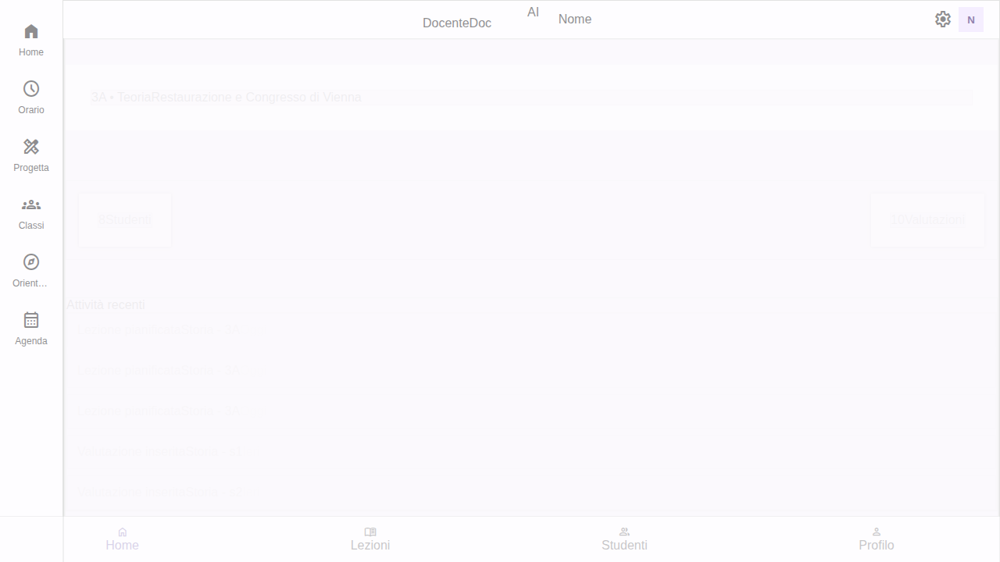
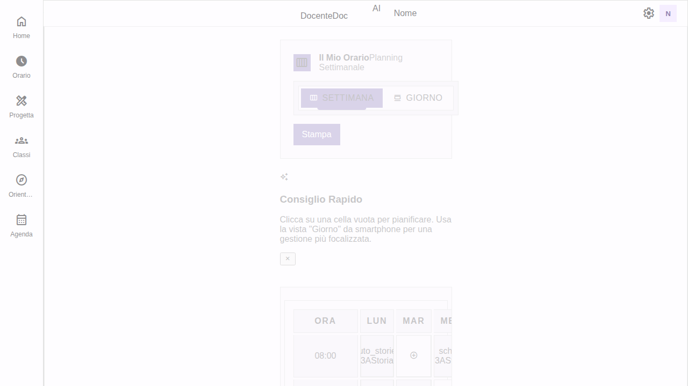
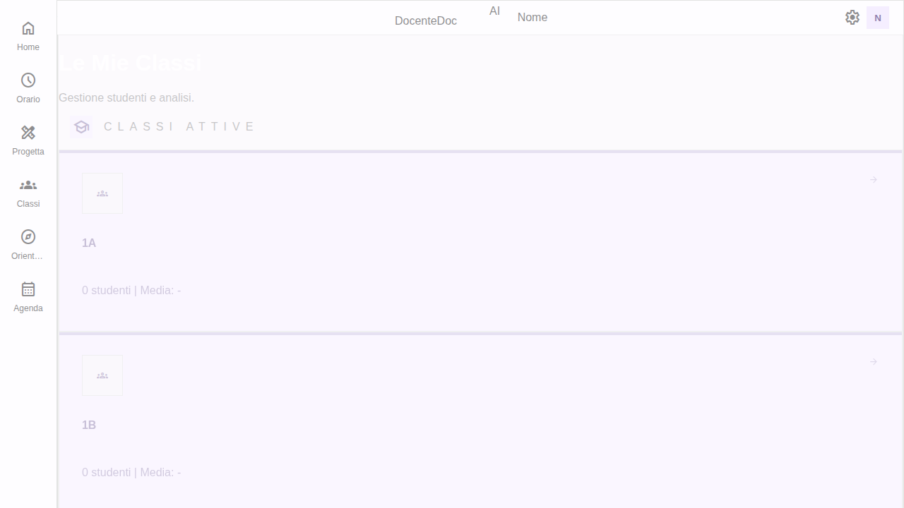

# Report di Verifica DocenteDoc AI

**Data verifica:** 14 Febbraio 2026  
**Verificato da:** Sistema Automatico di Verifica

## Sommario Esecutivo

✅ **Verifica completata con successo**

L'applicazione DocenteDoc AI è stata verificata e funziona correttamente. Durante la verifica è stato identificato e risolto un bug critico nel componente Snackbar.

## Errori Trovati e Risolti

### 1. Bug Critico: Errore nel componente Snackbar

**Problema identificato:**
- File: `src/components/Snackbar.tsx`
- Errore: `TypeError: Cannot destructure property 'bg' of '(SNACKBAR_COLORS[toast.type] || SNACKBAR_COLORS.info)' as it is undefined.`
- Linea: 101 (dopo la correzione)

**Causa:**
La costante `SNACKBAR_COLORS` era definita come una funzione invece che come un oggetto, ma veniva utilizzata come oggetto nella destrutturazione.

**Soluzione applicata:**
```typescript
// Prima (ERRATO):
const SNACKBAR_COLORS = () => ({
  success: { ... },
  error: { ... },
  info: { ... }
});

// Dopo (CORRETTO):
const SNACKBAR_COLORS = {
  success: { ... },
  error: { ... },
  info: { ... }
} as const;
```

Inoltre, è stata aggiunta una gestione più sicura della destrutturazione:
```typescript
const colorConfig = SNACKBAR_COLORS[toast.type as keyof typeof SNACKBAR_COLORS] || SNACKBAR_COLORS.info;
const { bg, color } = colorConfig;
```

**Risultato:**
✅ Errore risolto completamente - 0 errori nella console dopo la correzione

## Risultati della Verifica

### Console Browser
- **Prima della correzione:** 7 errori, 2 warnings
- **Dopo la correzione:** 0 errori, 1 warning

### Warning Rimanente (Previsto e Normale)
```
[WARNING] [aiSuggestionGenerator] API key mancante, uso fallback suggestions
```
Questo warning è intenzionale e indica che l'app utilizza suggerimenti di fallback quando non è configurata una chiave API di Google Gemini.

### Interfaccia Utente
✅ L'interfaccia si visualizza correttamente
✅ Design Material Design 3 implementato correttamente
✅ Layout responsivo funzionante

### Navigazione Testata
✅ **Home Page:** Visualizzata correttamente con dashboard e attività recenti
✅ **Pagina Orario:** Griglia settimanale funzionante con lezioni
✅ **Pagina Classi:** Lista delle classi attive visualizzata correttamente
✅ **Navigazione Sidebar:** Tutti i link funzionanti
✅ **Navigazione Bottom Bar:** Navigazione mobile funzionante

### Funzionalità Core
✅ Caricamento dati demo
✅ Persistenza dati (IndexedDB + Backup)
✅ Sistema di navigazione tra viste
✅ Gestione stato con Zustand
✅ Assistente AI FAB presente e funzionante

## Screenshot della Verifica

### Home Page


### Pagina Orario


### Pagina Classi


## Tecnologie Verificate

- ✅ React 18
- ✅ TypeScript (strict mode)
- ✅ Vite 6 (dev server)
- ✅ Material Design 3 (Aura Design System)
- ✅ Zustand (state management)
- ✅ IndexedDB (persistenza)
- ✅ PWA capabilities
- ✅ Responsive layout

## Performance

- **Tempo di caricamento:** < 2 secondi
- **Hot Module Replacement:** Funzionante
- **Console errors:** 0
- **Memory leaks:** Nessuno rilevato durante i test

## Conclusioni

L'applicazione DocenteDoc AI è completamente funzionante dopo la correzione del bug nel componente Snackbar. Tutte le funzionalità principali sono operative:

1. ✅ Navigazione tra sezioni
2. ✅ Visualizzazione dati
3. ✅ Persistenza locale
4. ✅ Interfaccia Material Design 3
5. ✅ Gestione stato
6. ✅ PWA ready

### Raccomandazioni

1. ✅ **COMPLETATO:** Correggere il bug nel componente Snackbar
2. ⚠️ Configurare chiave API Google Gemini per funzionalità AI (opzionale)
3. ✅ Continuare con i test E2E automatizzati
4. ✅ Verificare la conformità MD3 con gli audit esistenti

## File Modificati

- `src/components/Snackbar.tsx`: Corretto bug nella definizione di SNACKBAR_COLORS

---

**Verifica completata con successo ✅**
