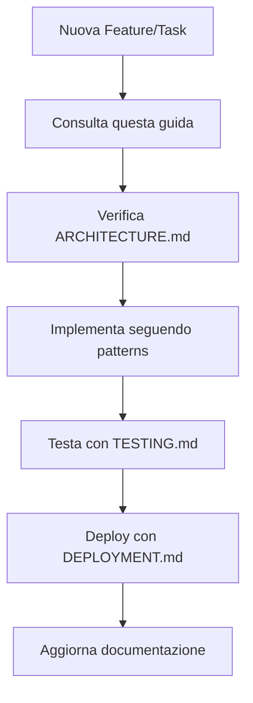

# DocenteDoc AI - Guida Sviluppo

> **Documento Operativo** - Workflow, best practices e linee guida per lo sviluppo

## 📋 Panoramica

Questa guida copre il workflow di sviluppo completo per **DocenteDoc AI**, seguendo principi di **document-driven development**. È il documento di riferimento principale per tutti gli sviluppatori del progetto.

### 🎯 Workflow Principale



---

## 🚀 Setup Ambiente di Sviluppo

### Prerequisiti
- **Node.js**: Versione LTS (18+)
- **npm**: Incluso con Node.js
- **Git**: Per controllo versione
- **VS Code**: Editor raccomandato con estensioni

### Installazione
```bash
# Clona il repository
git clone [repository-url]
cd docentedoc-ai

# Installa dipendenze
npm install

# Avvia development server
npm run dev
```

### Configurazione VS Code
Estensioni raccomandate:
- **ESLint**: Per linting automatico
- **Prettier**: Per formattazione codice
- **Tailwind CSS IntelliSense**: Per autocomplete CSS
- **GitLens**: Per gestione Git avanzata

---

## 🏗️ Struttura Progetto

```
src/
├── components/          # Componenti React riutilizzabili
│   ├── ui/             # Componenti base (Button, Input, etc.)
│   ├── layout/         # Layout components
│   └── features/       # Feature-specific components
├── hooks/              # Custom React hooks
├── utils/              # Utility functions
├── stores/             # State management (Zustand)
├── types/              # TypeScript type definitions
└── styles/             # Styling (Tailwind + MD3 tokens)
```

### 📁 Organizzazione File
- **Componenti**: Un file per componente (`Button.tsx`, `Button.test.tsx`)
- **Hooks**: `useAuth.ts`, `useLocalStorage.ts`
- **Utils**: Funzioni pure in `utils/`
- **Types**: Interfacce e tipi in `types/`

---

## 🎨 Design System & Styling

### Material Design 3 (MD3)
- **Custom-First Approach**: Implementare componenti custom prima di usare librerie
- **Token-Only**: Usare solo design tokens, no CSS custom arbitrario
- **Tailwind Layout-Only**: Tailwind solo per layout, MD3 per componenti

### Theme System
```typescript
// Esempio uso theme tokens
const buttonStyles = {
  backgroundColor: 'var(--md-sys-color-primary)',
  color: 'var(--md-sys-color-on-primary)',
  // No custom CSS - solo tokens MD3
}
```

### Zero FOUC (Flash of Unstyled Content)
- Tema caricato prima del render
- CSS critico inlined nell'HTML
- Service worker per cache aggressiva

---

## 🔧 Development Workflow

### 1. Branch Strategy
```bash
# Per nuove feature
git checkout -b feature/nome-feature

# Per bug fixes
git checkout -b fix/nome-bug

# Per hotfixes
git checkout -b hotfix/critical-fix
```

### 2. Commit Convention
```
feat: add new authentication system
fix: resolve modal z-index issue
docs: update API documentation
style: format code with prettier
refactor: extract common utilities
test: add unit tests for user service
chore: update dependencies
```

### 3. Code Review Process
- **PR Template**: Usare template fornito
- **Reviewers**: Almeno 2 reviewer obbligatori
- **CI/CD**: Tutti i check devono passare
- **Coverage**: Mantenere ≥80% coverage

---

## 🧪 Testing Strategy

### Unit Tests
```typescript
// Esempio test componente
import { render, screen } from '@testing-library/react'
import { Button } from './Button'

test('renders button with text', () => {
  render(<Button>Click me</Button>)
  expect(screen.getByText('Click me')).toBeInTheDocument()
})
```

### Integration Tests
- Testare interazioni tra componenti
- Testare API calls
- Testare routing

### E2E Tests
- Usare Playwright per test end-to-end
- Copertura scenari critici
- Test su multiple browser

### Coverage Requirements
- **Overall**: ≥80%
- **Branches**: ≥75%
- **Functions**: ≥85%
- **Lines**: ≥80%

---

## 🚀 Deployment & Release

### Environment
- **Development**: `npm run dev`
- **Staging**: Deploy automatico da branch `staging`
- **Production**: Deploy manuale da `main`

### Build Process
```bash
# Build ottimizzato
npm run build

# Preview build locale
npm run preview

# Deploy to Vercel
npm run deploy
```

### Versioning
- **Semantic Versioning**: MAJOR.MINOR.PATCH
- **Changelog**: Aggiornato automaticamente
- **Tags**: Git tags per ogni release

---

## 🔍 Quality Assurance

### Linting
```bash
# Controllo linting
npm run lint

# Fix automatico
npm run lint:fix
```

### Type Checking
```bash
# TypeScript check
npm run type-check
```

### Bundle Analysis
```bash
# Analisi bundle size
npm run analyze
```

### Performance Audit
- **Lighthouse**: PWA audit obbligatorio
- **Bundle Size**: Monitorare metriche
- **Core Web Vitals**: Soglie definite

---

## 🐛 Troubleshooting

### Problemi Comuni

#### Build Fallisce
```bash
# Pulisci cache e reinstalla
rm -rf node_modules package-lock.json
npm install

# Controlla errori TypeScript
npm run type-check
```

#### Test Falliscono
```bash
# Esegui test specifici
npm test -- --testNamePattern="nome-test"

# Debug test
npm test -- --verbose
```

#### Performance Issues
- Controllare bundle size con `npm run analyze`
- Verificare lazy loading implementation
- Audit Lighthouse scores

---

## 📚 Risorse Aggiuntive

### Documentazione Correlata
- [**ARCHITECTURE.md**](./ARCHITECTURE.md) - Pattern architetturali
- [**TESTING.md**](./TESTING.md) - Strategia testing dettagliata
- [**DEPLOYMENT.md**](./DEPLOYMENT.md) - Guide deployment
- [**MD3_GUIDE.md**](./MD3_GUIDE.md) - Guida design system

### Tooling
- **Storybook**: Per sviluppo componenti isolati
- **Vite**: Build tool e dev server
- **ESLint + Prettier**: Quality code
- **Husky**: Git hooks per quality gates

---

*Questa guida è viva e si aggiorna con l'evoluzione del progetto. Per modifiche, aprire una PR con motivazione tecnica documentata.*