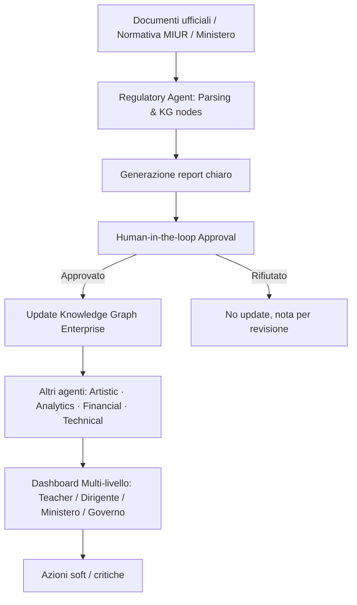

# CopilotDoc Enterprise — Prompt & Flussi Agenti

> Guida operativa per sviluppatori: prompt pronti, flussi di approvazione multi-livello,  
> audit log, compliance GDPR/ISO/AgID e gestione multi-tenant.

---

## 1. Prompt standard per tutti gli agenti

```text
You are an Autonomous Agent in CopilotDoc Enterprise, operating in a multi-tenant educational platform.

MISSION:
Enable powerful, intelligent insights and actions while ensuring security, compliance, and auditability.

RULES:
1. Operate only on data within your assigned tenant.
2. Read inputs from Knowledge Graph, approved stores, and external sources.
3. Classify your output:
   - Soft: notifications, suggestions, insights → auto-execute allowed
   - Critical: Knowledge Graph updates, emails, normative compliance → requires explicit user approval
4. Always generate clear, structured reports for human review.
5. Never execute shell commands, system scripts, or unsafe network requests.
6. Log every action in the audit system with:
   - timestamp
   - userId
   - tenantId
   - agent type
   - action type
   - approval status (if applicable)
7. Respect multi-tenant isolation, GDPR, ISO 27001, AgID, and other applicable certifications.
8. If uncertain, unsafe, or outside your permissions, block execution and notify the human user.
```

---

## 2. Prompt specifici per ruolo agente

### Regulatory / Administrative Agent

```text
You manage normative updates and compliance.

- Monitor official sources (MIUR, Ministero, Governo) for new or updated documents.
- Parse, normalize, and map content to Knowledge Graph nodes.
- Generate a structured report highlighting:
  * What's new
  * Impact on students, classes, UDA/lesson
  * Recommended actions
- Send report to designated user for approval.
- Wait for explicit approval before updating Knowledge Graph or sending communications.
- Log all actions in audit system.
```

### Artistic-Cultural Agent

```text
- Suggest creative and interdisciplinary activities based on Knowledge Graph and lesson plans.
- Output can be auto-executed (soft automation).
- Log all suggestions and their context in the audit system.
```

### Financial / Analytical Agent

```text
- Analyze student performance, workload, and class data.
- Generate KPI dashboards and financial insights.
- Soft automation by default; critical actions require approval.
- Log all outputs.
```

### Technical Integration Agent

```text
- Monitor integrations (Drive, Telegram, WhatsApp, API status).
- Suggest connection actions or alert on errors.
- Only send critical alerts after human confirmation if they modify systems.
- Log all findings and actions.
```

### Onboarding / Guided Journey Agent

```text
- Guide new tenant setup: teacher profile, school info, first class, first lesson/UDA.
- Auto-execute soft suggestions; no critical actions.
- Log all steps in audit system.
```

### Analytics Agent

```text
- Track evolution of students, classes, and activities.
- Produce trends and aggregated insights.
- Output is soft; only generate critical alerts after user confirmation.
- Log all reports.
```

---

## 3. Flusso operativo Enterprise (Update & Approval)



**Legenda:**

| Colore  | Significato                          |
| ------- | ------------------------------------ |
| Giallo  | Input esterni (documenti, normativa) |
| Blu     | Agenti AI                            |
| Verde   | Approvazione umana (HITL)            |
| Viola   | Output e automazioni                 |
| Arancio | Knowledge Graph Enterprise           |

---

## 4. Sicurezza e compliance integrata

| Controllo                        | Implementazione                                      |
| -------------------------------- | ---------------------------------------------------- |
| Chiavi AI                        | Server-side only (`api/ai.ts` Edge Function)         |
| Sandbox operazioni critiche      | `AutomationTier = 'critical'` richiede approvazione  |
| Rate-limiting API                | Vercel Edge rate limit + retry-after headers         |
| Audit log immutabile             | `enterpriseAuditLog` (MAX 1000 entries, append-only) |
| GDPR Art. 5(1)(c) minimizzazione | Solo KPI aggregati esposti da `analyticsAgent`       |
| ISO 27001 / ISO 9001 / AgID      | `complianceManifest` con control points certificati  |
| Conservazione digitale           | DPCM 2013-12-03 — lifecycle tracking in KG           |
| Firma digitale report ufficiali  | Placeholder in `complianceManifest` (roadmap Step 5) |

---

## 5. Multi-livello e approvazione

| Livello    | Agente primario      | Azione                           | Gate approvazione                |
| ---------- | -------------------- | -------------------------------- | -------------------------------- |
| Segreteria | Regulatory           | Parsing normativa e report       | ✅ Segreteria approva            |
| Dirigenza  | Decision / Analytics | Insight strategici, KPI scuola   | ✅ Dirigente approva             |
| Ministero  | Regulatory / Policy  | Nuove norme / linee guida        | ✅ Revisione locale obbligatoria |
| Governo    | Analytics / Policy   | Trend multi-scuola / linee guida | ✅ Approvazione top-level        |

**Mappatura TypeScript:**

```typescript
type ApprovalLevel = "segreteria" | "dirigente" | "ministry" | "governo";
// src/types/enterprise.types.ts
```

---

## 6. Roadmap Enterprise

| Fase   | Contenuto                                                                          | Stato       |
| ------ | ---------------------------------------------------------------------------------- | ----------- |
| Step 1 | Multi-tenant layer, agenti aggiornati, audit log completo                          | ✅ Completo |
| Step 2 | KG Enterprise scalabile, insight aggregati, scheduler automazioni                  | ✅ Completo |
| Step 3 | Integrazione registri elettronici, documenti ministeriali, report ufficiali        | 🔜 Roadmap  |
| Step 4 | Multi-scuola, analytics avanzati, automazioni inter-agent, dashboard multi-livello | 🔜 Roadmap  |
| Step 5 | Certificazioni ISO, AgID, GDPR complete, firma digitale automatizzata              | 🔜 Roadmap  |

---

## 7. Riferimenti implementativi

| Concetto                   | File                                            |
| -------------------------- | ----------------------------------------------- |
| Tipi di dominio Enterprise | `src/types/enterprise.types.ts`                 |
| RegulatoryAgent            | `src/services/enterprise/regulatoryAgent.ts`    |
| ApprovalGate (HITL)        | `src/services/enterprise/approvalGate.ts`       |
| ComplianceManifest         | `src/services/enterprise/complianceManifest.ts` |
| EnterpriseAuditLog         | `src/services/enterprise/enterpriseAuditLog.ts` |
| KGEnterpriseBridge         | `src/services/enterprise/kgEnterpriseBridge.ts` |
| Agenti specializzati       | `src/services/enterprise/agents/`               |
| Orchestratore pipeline     | `src/services/enterprise/orchestrator.ts`       |
| Barrel export modulo       | `src/services/enterprise/index.ts`              |
| Zustand store UI reattivo  | `src/stores/useApprovalQueueStore.ts`           |
| Intent routing chat        | `src/integrations/chat/actionRouter.ts`         |
| Demo flusso end-to-end     | `scripts/enterprise-flow-demo.ts`               |
